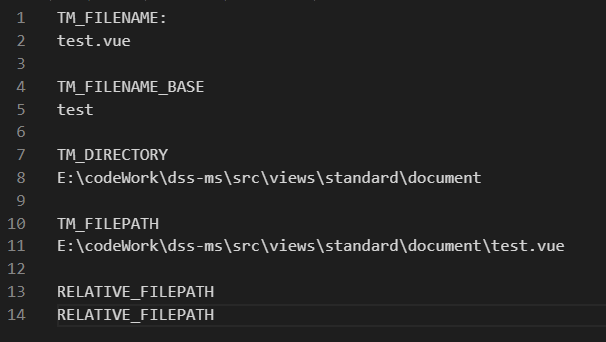

### 参考资料

官网文档:  https://code.visualstudio.com/docs/editor/userdefinedsnippets

方便书写：https://snippet-generator.app/?description=&tabtrigger=&snippet=&mode=vscode


### 自己总结

```json
{
	"Print to console": {
		"prefix": "vbase",
		"body": [
			"TM_FILENAME:",
			"${TM_FILENAME}",
			"",
			"TM_FILENAME_BASE",
			"${TM_FILENAME_BASE}",
			"",
			"TM_DIRECTORY",
			"${TM_DIRECTORY}",
			"",
			"TM_FILEPATH",
			"${TM_FILEPATH}",
			"",
			"RELATIVE_FILEPATH",
			"${RELATIVE_FILEPATH}"
		],
		"description": "Log output to console"
	}
}
```




