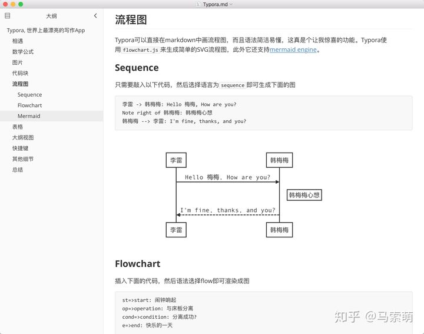

工具推荐

[TOC]

## [typora](https://www.typora.io/) [非常好用的markdown编辑器，所见即所得]

## [responsively](https://responsively.app/) [响应式布局，一个界面尽收眼底]

## [smalldev](https://smalldev.tools/) [代码分享床、JSON 格式化、base64 加解密、HTML/JS/CSS 格式化、压缩 SQL、生成占位图、生成测试数据等等]

代码分享床、JSON 格式化、base64 加解密、HTML/JS/CSS 格式化、压缩 SQL、生成占位图、生成测试数据等等；

 的优势就是 **功能全、颜值高、没广告**😎；

## [type-scale](https://type-scale.com/) [可视化预览字体效果]

 这个网站用于把不同字体大小，rem 和 em 值的差异进行可视化展现，支持实时预览

## [snipaste](https://zh.snipaste.com/) [强大的截图工具]

参考文章： https://www.iplaysoft.com/snipaste.html

很多网友使用之后纷纷表示已经可以淘汰 [QQ](https://www.iplaysoft.com/qq.html) 截图、[Jing](https://www.iplaysoft.com/jing.html)、[FastStone](https://www.iplaysoft.com/faststone-capture.html)、[WinSnap](https://www.iplaysoft.com/winsnap.html)、Snagit、PicPick 等工具了。

1. 智能截图：自动检测界面元素边界

2. 精确控制截图范围

   - 键盘 `w`/`s`/`a`/`d` 可以移动光标上下左右精确移动

   - `Shift` + `↑`/`↓`/`←`/`→` 缩小截图区域
   - `Ctrl` +`↑`/`↓`/`←`/`→` 扩大截图区域

3. 屏幕截图过程回放

4. 屏幕取色

5. 将图片作为窗口置顶显示

方便查看和对比代码

6.7.8....等等

## [Listary](https://www.listary.com/download) (轻量快捷搜索系统文件)

相比everything更轻量， 启动搜索快捷

## [图床工具picgo](https://github.com/Molunerfinn/picgo/releases) [配合gitee方便管理图片]

[推荐一款很好用的图床工具picgo](https://juejin.cn/post/6978975135596281864)

## [Md2All](http://md.aclickall.com/) [在线markdown转html]

